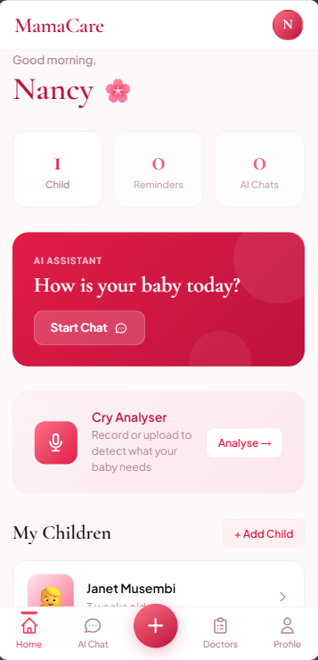
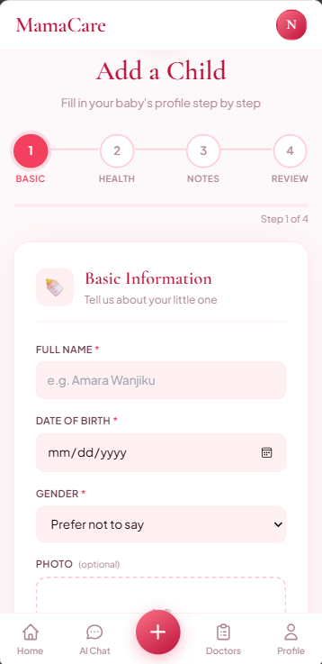
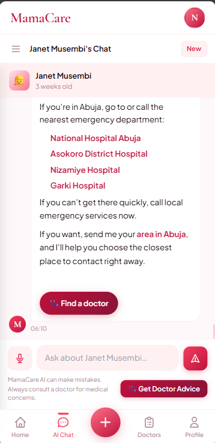
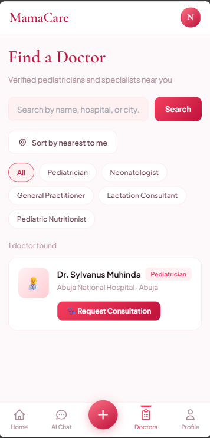
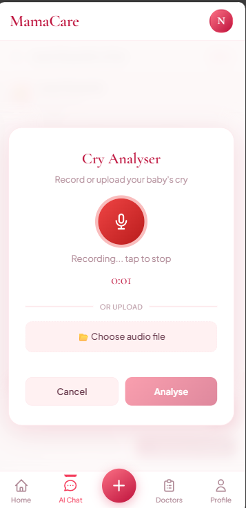
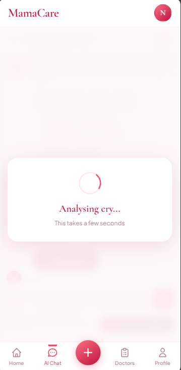
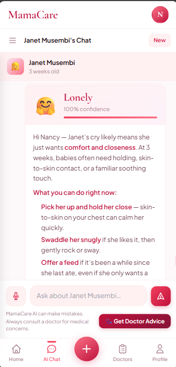
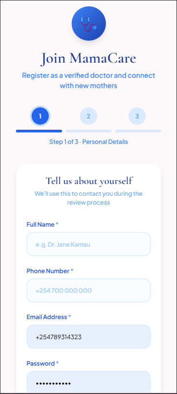
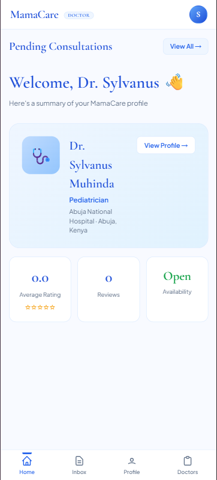
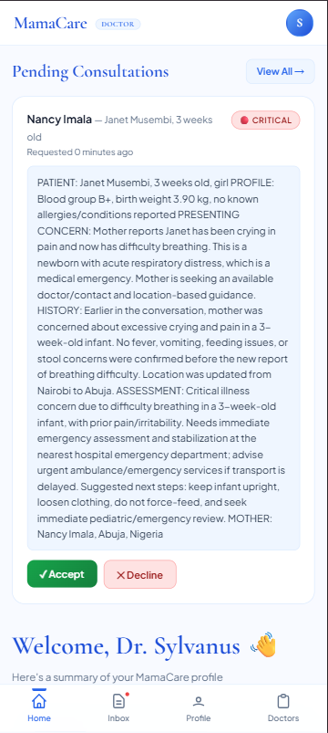

# MamaCare AI

AI-powered maternal care platform helping new mothers monitor newborn health, analyse baby cries, and connect with doctors — built on Azure OpenAI and deployable as a Progressive Web App.

---

## Table of Contents

- [About](#about)
- [Azure Services Used](#azure-services-used)
- [Responsible AI](#responsible-ai)
- [Getting Started (Developers)](#getting-started-developers)
- [User Guide — Mothers](#user-guide--mothers)
- [User Guide — Doctors](#user-guide--doctors)

---

## About

MamaCare AI supports new mothers through the stressful early weeks of newborn care. It provides 24/7 AI-driven health guidance, real-time baby cry analysis, and seamless access to verified paediatric doctors — all from a single Progressive Web App that works even offline.

The platform has two sides: a mother-facing app for daily newborn care support, and a doctor portal where verified paediatricians receive and manage consultation requests.

---

## Azure Services Used

- **Azure OpenAI (GPT-4)** — AI health chat, clinical report generation, symptom severity assessment
- **Azure App Service (Linux, Python 3.13)** — production hosting with Gunicorn
- **Azure Database** — persistent storage for child profiles, consultations, and push subscriptions
- **TensorFlow on Azure** — baby cry classification model (8 cry types)

---

## Responsible AI

- AI responses are scoped strictly to maternal and newborn health. Off-topic requests are redirected.
- Clinical reports generated by AI are clearly labelled as AI-generated summaries, not medical diagnoses.
- Every chat interface shows the disclaimer: "MamaCare AI can make mistakes. Always consult a doctor for medical concerns."
- Severity assessments always recommend professional care for anything beyond mild concerns.
- All child health data is stored per-user and never shared across accounts.
- Doctors are manually reviewed and approved by administrators before appearing on the platform.

---

## Getting Started (Developers)

### Prerequisites

- Python 3.11+
- Azure OpenAI API key and deployment
- VAPID keys for Web Push notifications (generate with `pywebpush`)

### Installation

```bash
git clone https://github.com/enricoshilisia/mamacareai.git
cd mamacareai
python -m venv venv
source venv/bin/activate  # Windows: venv\Scripts\activate
pip install -r requirements.txt
```

### Environment Variables

Create a `.env` file in the project root:

```
DJANGO_SECRET_KEY=your-secret-key
DJANGO_DEBUG=True
DJANGO_ALLOWED_HOSTS=localhost,127.0.0.1
AZURE_OPENAI_ENDPOINT=https://your-resource.openai.azure.com/
AZURE_OPENAI_API_KEY=your-api-key
AZURE_OPENAI_DEPLOYMENT=gpt-4
VAPID_PUBLIC_KEY=your-vapid-public-key
VAPID_PRIVATE_KEY_B64=your-urlsafe-base64-encoded-pem
VAPID_ADMIN_EMAIL=admin@yourdomain.com
```

### Run

```bash
python manage.py migrate
python manage.py createsuperuser
python manage.py runserver
```

Open `http://localhost:8000` in your browser.

---

## User Guide — Mothers

### Dashboard



After logging in, the home screen gives you an at-a-glance summary of your children, reminders, and AI chat sessions. Tap **Start Chat** to talk to the MamaCare AI assistant, or use the bottom navigation to access AI Chat, Doctors, and your Profile. The **+** button in the centre lets you add a new child at any time.

---

### Adding a Child



Tap the **+** button or **Add Child** from the dashboard. The form walks you through four steps:

1. **Basic** — name, date of birth, gender, and an optional photo
2. **Health** — blood group, birth weight, known allergies, and hospital of birth
3. **Notes** — any additional notes for the AI to consider
4. **Review** — confirm everything before saving

The more detail you provide, the more accurate and personalised the AI's advice will be.

---

### AI Chat



Select a child and tap **Start Chat** or **AI Chat** from the bottom navigation. You can ask anything about your baby's health — feeding, sleep, temperature, rashes, development, and more. The AI knows your child's profile and tailors every response accordingly.

When the AI detects a situation that may need professional attention, it will suggest finding a doctor and show a **Find a doctor** button directly in the chat. Tap it to be taken straight to the doctor list.

The disclaimer at the bottom is always visible: AI responses are guidance only and not a substitute for professional medical advice.

---

### Finding a Doctor



Tap **Doctors** in the bottom navigation. All verified paediatricians and specialists on the platform are listed. You can filter by specialty — Paediatrician, Neonatologist, General Practitioner, Lactation Consultant, or Paediatric Nutritionist — and sort by nearest to you.

Tap **Request Consultation** on any doctor's card. Your recent AI conversation about your child is automatically summarised into a clinical report and sent to the doctor silently — you do not need to type your symptoms again.

---

### Cry Analyser — Recording



Tap **AI Chat** then the microphone button, or navigate to the Cry Analyser. Tap the red microphone to start recording your baby's cry. Tap again to stop. You can also upload an existing audio file using the **Choose audio file** option. Once ready, tap **Analyse**.

---

### Cry Analyser — Processing



After submitting the recording, the app processes the audio. This takes a few seconds. A spinner confirms that analysis is in progress.

---

### Cry Analyser — Results



The result appears directly in the chat. The AI identifies the most likely cause of the cry — in this example, **Lonely** with 100% confidence — and explains what it means for a baby of that age. It then gives specific, practical steps you can take right now, such as skin-to-skin contact, swaddling, or feeding. If the cry pattern suggests something more serious, the AI will flag it and recommend seeking medical attention.

---

## User Guide — Doctors

### Registration



Doctors register separately at the doctor portal. The sign-up form is a 3-step process:

1. **Personal Details** — full name, phone number, email, and password
2. **Professional Details** — specialisation, medical licence number, hospital, and location
3. **Review** — confirm your details before submitting

After submitting, your account goes through an admin review process. You will be notified once approved. Only approved doctors appear to mothers on the platform.

---

### Doctor Dashboard



After logging in, your dashboard shows your profile summary — name, specialisation, hospital, location, average rating, number of reviews, and your current availability status. Use the bottom navigation to move between Home, Inbox, Profile, and the Doctors directory.

You will receive a push notification on your phone whenever a mother requests a consultation — even if the app is closed.

---

### Inbox — Pending Requests and Active Chats


The Inbox is divided into two sections:

**Pending Requests** — new consultation requests waiting for your response. Each request includes the mother's name, the child's name, and a clinical report generated by the AI from the mother's recent conversation. Tap a request to review it and choose to accept or decline.

**Active Chats** — consultations you have accepted and are currently managing. Each entry shows the mother's name, the child, when it was last updated, and a severity badge. Tap **Open Chat** to continue the conversation or **Complete** to close it when the consultation is done.

---

### Reviewing a Pending Request



When you open a pending consultation, you see the full AI-generated clinical report summarising the mother's recent conversations about the child — covering the presenting concern, child profile, history, and an initial assessment. This gives you the context you need before accepting. Tap **Accept** to open a chat with the mother or **Decline** if the case is outside your scope.
